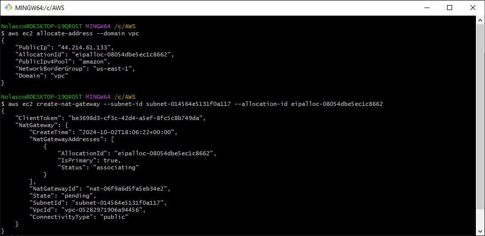

# AWS RDS Creation 

This lab focuses on creating an RDS instance with high availability and integrating it with a web server to implement a simple CRUD application.

<div align="center">
  
</div>

---

## Objectives

- Launch an Amazon RDS DB instance with high availability.
- Configure the DB instance to permit connections from web server.
- Open a web application and interact with database.

---

⚠️ **Attention**
---   
- All the tasks will be completed via the command line using AWS CLI. Ensure you have the necessary permissions. [Install AWS CLI](https://docs.aws.amazon.com/cli/latest/userguide/getting-started-install.html)
- Charges may apply for completing this lab. [AWS Pricing](https://aws.amazon.com/pricing/)

---

## Step 1: VPC Creation
#### 1.1. Create a VPC with CIDR block 10.0.0.0/16:
```bash
aws ec2 create-vpc --cidr-block 10.0.0.0/16 \
  --tag-specifications 'ResourceType=vpc,Tags=[{Key=Name,Value=my-vpc}]'
```

<div align="center">
  
</div>

---

## Step 2: Create Subnets
#### 2.1. Create Public Subnet 1 in Availability Zone A with CIDR block 10.0.0.0/24:
```bash
aws ec2 create-subnet \
  --vpc-id <vpc-id> \
  --cidr-block 10.0.0.0/24 \
  --availability-zone <az-a> \
  --tag-specifications 'ResourceType=subnet,Tags=[{Key=Name,Value=public-subnet-1}]'
```

<div align="center">
  
</div>

#### 2.2. Create Private Subnet 1 in Availability Zone A with CIDR block 10.0.1.0/24:
```bash
aws ec2 create-subnet \
  --vpc-id <vpc-id> \
  --cidr-block 10.0.1.0/24 \
  --availability-zone <az-a> \
  --tag-specifications 'ResourceType=subnet,Tags=[{Key=Name,Value=private-subnet-1}]'
```

<div align="center">
  
</div>

#### 2.3. Create Public Subnet 2 in Availability Zone B with CIDR block 10.0.2.0/24:
```bash
aws ec2 create-subnet \
  --vpc-id <vpc-id> \
  --cidr-block 10.0.2.0/24 \
  --availability-zone <az-b> \
  --tag-specifications 'ResourceType=subnet,Tags=[{Key=Name,Value=public-subnet-2}]'
```

<div align="center">
  
</div>

#### 2.4. Create Private Subnet 2 in Availability Zone B with CIDR block 10.0.3.0/24:
```bash
aws ec2 create-subnet \
  --vpc-id <vpc-id> \
  --cidr-block 10.0.3.0/24 \
  --availability-zone <az-b> \
  --tag-specifications 'ResourceType=subnet,Tags=[{Key=Name,Value=private-subnet-2}]'
```

<div align="center">
  
</div>

---

## Step 3: Create an Internet Gateway and Attach to VPC
#### 3.1. Create an internet gateway:
```bash
aws ec2 create-internet-gateway \
  --tag-specifications 'ResourceType=internet-gateway,Tags=[{Key=Name,Value=my-igw}]'
```
#### 3.2. Attach the internet gateway to the VPC:
```bash
aws ec2 attach-internet-gateway \
  --vpc-id <vpc-id> \
  --internet-gateway-id <igw-id>
```

<div align="center">
  
</div>

---

## Step 4: Set up NAT Gateway in Public Subnet 1
#### 4.1. Allocate an Elastic IP address for the NAT Gateway:
```bash
aws ec2 allocate-address --domain vpc
```
#### 4.2. Create the NAT Gateway in Public Subnet 1:
```bash
aws ec2 create-nat-gateway \
  --subnet-id <public-subnet-1-id> \
  --allocation-id <elastic-ip-allocation-id>
```

<div align="center">
  
</div>

---

## Step 5: Create Route Tables and Associate with Subnets
#### 5.1. Create a route table for public subnets and associate with Public Subnet 1 and Public Subnet 2:
```bash
aws ec2 create-route-table \
  --vpc-id <vpc-id> \
  --tag-specifications 'ResourceType=route-table,Tags=[{Key=Name,Value=public-route-table}]'
```

<div align="center">
  
</div>

#### 5.2. Create a route to the internet through the internet gateway:
```bash
aws ec2 create-route \
  --route-table-id <public-route-table-id> \
  --destination-cidr-block 0.0.0.0/0 \
  --gateway-id <igw-id>
```

<div align="center">
  
</div>

#### 5.3. Associate the route table with Public Subnet 1 and Public Subnet 2:
```bash
aws ec2 associate-route-table --route-table-id <public-route-table-id> --subnet-id <public-subnet-1-id>
aws ec2 associate-route-table --route-table-id <public-route-table-id> --subnet-id <public-subnet-2-id>
```

<div align="center">
  
</div>

#### 5.4. Create a route table for private subnets and associate with Private Subnet 1 and Private Subnet 2:
```bash
aws ec2 create-route-table \
  --vpc-id <vpc-id> \
  --tag-specifications 'ResourceType=route-table,Tags=[{Key=Name,Value=private-route-table}]'
```

<div align="center">
  
</div>

#### 5.5. Create a route to the NAT Gateway for internet access from private subnets:
```bash
aws ec2 create-route \
  --route-table-id <private-route-table-id> \
  --destination-cidr-block 0.0.0.0/0 \
  --nat-gateway-id <nat-gateway-id>
```

<div align="center">
  
</div>

#### 5.6. Associate the private route table with Private Subnet 1 and Private Subnet 2:
```bash
aws ec2 associate-route-table --route-table-id <private-route-table-id> --subnet-id <private-subnet-1-id>
aws ec2 associate-route-table --route-table-id <private-route-table-id> --subnet-id <private-subnet-2-id>
```

<div align="center">
  
</div>

---

## Step 6: Creat Security Groups
#### 6.1. Create a security group for the EC2 instance that allows HTTP traffic:
```bash
aws ec2 create-security-group \
  --group-name web-sg \
  --description "Security group for web server" \
  --vpc-id <vpc-id>
```
#### 6.2. Allow inbound HTTP traffic to the EC2 security group:
```bash
aws ec2 authorize-security-group-ingress \
  --group-id <web-sg-id> \
  --protocol tcp --port 80 \
  --cidr 0.0.0.0/0
```

<div align="center">
  
</div>

---

⚠️ **Important:** To troubleshoot your EC2 instance, allow access to port 22 (SSH) in your security group.

---
#### 6.3. Create a security group for RDS that allows incoming traffic from the web server on port 3306 (MySQL):
```bash
aws ec2 create-security-group \
  --group-name rds-sg \
  --description "Security group for RDS" \
  --vpc-id <vpc-id>
```
#### 6.4. Allow inbound traffic to the RDS security group:
```bash
aws ec2 authorize-security-group-ingress \
  --group-id <rds-sg-id> \
  --protocol tcp --port 3306 \
  --source-group <web-sg-id>
```

<div align="center">
  
</div>

---

## Step 7: Create a Subnet Group for RDS
#### 7.1. Create a subnet group for the RDS instance:
```bash
aws rds create-db-subnet-group \
  --db-subnet-group-name mydbsubnetgroup \
  --db-subnet-group-description "Subnet group for RDS" \
  --subnet-ids <private-subnet-1-id> <private-subnet-2-id>
```

<div align="center">
  
</div>

---

## Step 8: Set Up RDS Primary and Secondary in Private Subnets
#### 8.1. Create an RDS instance in Private Subnet 1 (primary) and Private Subnet 2 (secondary) with Multi-AZ enabled:
```bash
aws rds create-db-instance \
  --db-instance-identifier mydbinstance \
  --db-instance-class db.t3.micro \
  --engine mysql \
  --engine-version <version> \
  --master-username <username> \
  --master-user-password <password> \
  --allocated-storage 20 \
  --vpc-security-group-ids <rds-sg-id> \
  --db-subnet-group-name <subnet-group-name> \
  --multi-az \
  --db-subnet-group-name mydbsubnetgroup \
  --backup-retention-period 0
```

<div align="center">
  
</div>

#### 8.2. Verify RDS creation and retrieve the endpoint:
```bash
aws rds describe-db-instances \
  --db-instance-identifier database-1 \
  --query "DBInstances[*].[Endpoint.Address,AvailabilityZone,PreferredBackupWindow,BackupRetentionPeriod,DBInstanceStatus]"
```

<div align="center">
  
</div>

---

## Step 9: Launch Web Server in Public Subnet 2
#### 9.1. Launch an EC2 instance with an Amazon Linux 2023 AMI in Public Subnet 2 with a security group that allows HTTP traffic (port 80):
```bash
aws ec2 run-instances \
  --image-id ami-0ebfd941bbafe70c6 \
  --instance-type t2.micro \
  --key-name <key-pair-name> \
  --security-group-ids <web-sg-id> \
  --subnet-id <public-subnet-2-id> \
  --associate-public-ip-address \
  --user-data <file://install-web-server.sh>
```

---
#### Important ⚠️
**Before launching EC2**

Edit `install-web-server.sh` with your RDS credentials:
- Replace `REPLACE_WITH_YOUR_*` placeholders in with your specific values
```php
sudo sed -i "s/\$host = 'your-rds-endpoint.amazonaws.com';/\$host = 'REPLACE_WITH_YOUR_RDS_ENDPOINT';/" /var/www/html/index.php
sudo sed -i "s/\$username = 'your_rds_username';/\$username = 'REPLACE_WITH_YOUR_RDS_USERNAME';/" /var/www/html/index.php
sudo sed -i "s/\$password = 'your_rds_password';/\$password = 'REPLACE_WITH_YOUR_RDS_PASSWORD';/" /var/www/html/index.php
sudo sed -i "s/\$dbname = 'your_database_name';/\$dbname = 'REPLACE_WITH_YOUR_DATABASE_NAME';/" /var/www/html/index.php
```

<div align="center">
  
</div>

#### 9.2. Retrieve the instance's IPv4 Public Address and test the web server:

<div align="center">
  
</div>

<div align="center">
  
</div>

---

## Step 10: Clean Up Resources (Optional)
#### 10.1. Terminate the EC2 instance:
```bash
aws ec2 terminate-instances --instance-ids <instance-id>
```

<div align="center">
  
</div>

#### 10.2. Delete the RDS instance:
```bash
aws rds delete-db-instance --db-instance-identifier mydbinstance --skip-final-snapshot
```

<div align="center">
  
</div>

#### 10.3. Delete the NAT gateway:
```bash
aws ec2 delete-nat-gateway --nat-gateway-id <nat-gateway-id>
```

<div align="center">
  
</div>

#### 10.4. Release the Elastic IP:
```bash
aws ec2 release-address --allocation-id <elastic-ip-allocation-id>
```

<div align="center">
  
</div>

#### 10.5. Detach and Delete the Internet Gateway from the VPC:
```bash
aws ec2 detach-internet-gateway --vpc-id <vpc-id> --internet-gateway-id <igw-id>
aws ec2 delete-internet-gateway --internet-gateway-id <igw-id>
```

<div align="center">
  
</div>

#### 10.6. Delete the RDS subnet group:
```bash
aws rds delete-db-subnet-group --db-subnet-group-name mydbsubnetgroup
```

<div align="center">
  
</div>

#### 10.7. Delete the security groups:
```bash
aws ec2 delete-security-group --group-id <rds-security-group-id>
aws ec2 delete-security-group --group-id <ec2-security-group-id>
```

<div align="center">
  
</div>

#### 10.8. Delete the subnets:
```bash
aws ec2 delete-subnet --subnet-id <private-subnet-1-id>
aws ec2 delete-subnet --subnet-id <private-subnet-2-id>
aws ec2 delete-subnet --subnet-id <public-subnet-1-id>
aws ec2 delete-subnet --subnet-id <public-subnet-2-id>
```

<div align="center">
  
</div>

#### 10.9. Delete the route tables:
```bash
aws ec2 delete-route-table --route-table-id <private-route-table-id>
aws ec2 delete-route-table --route-table-id <public-route-table-id>
```

<div align="center">
  
</div>

#### 10.10. Delete the VPC:
```bash
aws ec2 delete-vpc --vpc-id <vpc-id>
```

<div align="center">
  
</div>

---

## Conclusion
In this lab I learned how to launch an RDS instance and connect it to a web server using an EC2 instance. This experience helped me understand how to integrate multiple AWS services with a focus on high availability.

The total cost for this lab was $0.35, mainly due to the NAT Gateway associated with the EC2 instance. Below is the cost analysis from AWS:

<div align="center">
  
</div>
